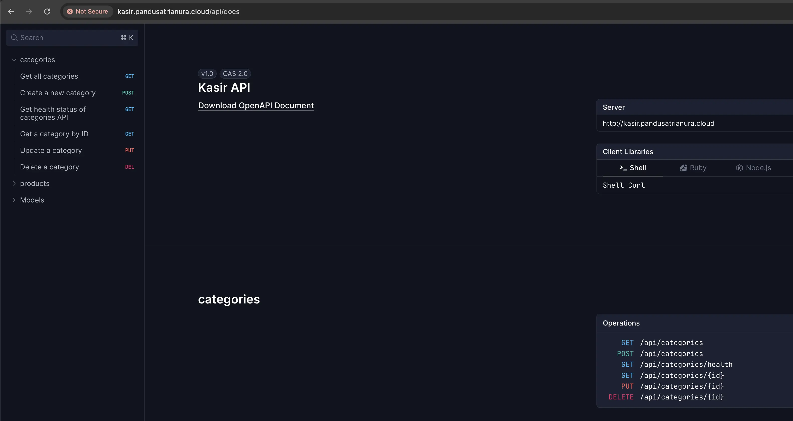

<div align="center">

<h2> Project Name : Kasir API </h2>

[](#)
[](#)
[](#)
[](#)
[](#)
[](#)



</div>

## 🎯 Task 

- [x] Session 1: https://docs.kodingworks.io/s/17137b9a-ed7a-4950-ba9e-eb11299531c2#h-%F0%9F%8E%AF-tugas
- [x] Session 2: https://docs.kodingworks.io/s/a378a9fe-c0e0-4fa1-a896-43ae347a7b61
- [ ] Session 3: To be updated

## 💡 Overview

### Task Session 1
1. Implementasikan CRUD Kategori pada project API kalian.

### Task Session 2
1. Pindah categories temen-temen ke layered architecture.
2. **Challange (Optional):** Explore Join, tambah category_id ke table products, setiap product mempunyai kategory, dan ketika Get Detail return category.name dari product.

```json
{
   "code": "1000",
   "message": "Product retrieved successfully",
   "data": {
      "id": 1,
      "name": "Bebelac",
      "price": 10000,
      "stock": 100,
      "category_id": 1,
      "category_name": "Susu",
      "created_at": "2026-01-29T04:27:44.690013+07:00",
      "updated_at": "2026-01-29T04:27:44.690013+07:00"
   }
}
```
### Task Session 3
1. To be updated.

## ✨ Model

### Category
- **ID**
- **Name**
- **Description**
- **Created At**
- **Updated At**

### Product
- **ID**
- **Name**
- **Price**
- **Stock**
- **Category ID**
- **Created At**
- **Updated At**

### Transaction
- **ID**
- **Total Amount**
- **Created At**
- **Updated At**

### Transaction Detail
- **ID**
- **Transaction ID**
- **Product ID**
- **Quantity**
- **Subtotal**
- **Created At**
- **Updated At**

## 📖 API Endpoints

The application provides several API endpoints for the functionalities mentioned above. Below are some key endpoints:

### General
- **Health Check API Endpoint**: `GET /api/health/service` 
- **Health Check Database Endpoint**: `GET /api/health/db`
- **Kasir API Docs Endpoint**: `GET /api/docs`

### Category
- **Health Check Category API Endpoint**: `GET /api/categories/health`
- **Ambil semua kategori**: `GET /categories`
- **Tambah satu kategori**: `POST /categories`
- **Update satu kategori**: `PUT /categories/{id}`
- **Ambil detail satu kategori**: `GET /categories/{id}`
- **Hapus satu kategori**: `DELETE /categories/{id}`

### Product
- **Health Check Product API Endpoint**: `GET /api/products/health`
- **Ambil semua produk**: `GET /products`
- **Tambah satu produk**: `POST /products`
- **Update satu produk**: `PUT /products/{id}`
- **Ambil detail satu produk**: `GET /products/{id}`
- **Hapus satu produk**: `DELETE /products/{id}`

### Product
- **Health Check Transactions/Checkout API Endpoint**: `GET /api/transactions/health`
- **Checkout transaksi**: `POST /transactions/checkout`

## 🛠️ Installation

1. **Clone the Repository**:
   ```bash
   git clone https://github.com/pandusatrianura/kasir_api_service
   ```

2. **Install Dependencies**:
   ```bash
   cd github.com/pandusatrianura/kasir_api_service
   go mod tidy
   ```

3. **Add .env file**
   ```bash
   PORT=8080
   DATABASE_HOST="aws.supabase.com"
   DATABASE_PORT=1234
   DATABASE_USER="postgres"
   DATABASE_PASSWORD="xxxx"
   DATABASE_NAME="kasir-db"
   DATABASE_SSL_MODE="disable"
   DATABASE_MAX_LIFETIME_CONNECTION=30
   DATABASE_MAX_IDLE_CONNECTION= 50
   DATABASE_MAX_OPEN_CONNECTION= 100
   ```

4. **Run the Application**:
   ```bash
   go run main.go 
   ```

## 📦 Access the API Documentation
    
1. Use tools like Postman or cURL to interact with the API endpoints.
    
   ```bash
   postman collection: docs/kasir-api.postman_collection.json
   postman environment: docs/kasir-api.postman_environment.json
   ```
2. Use API Documentation to interact with the API endpoints.
    
    ```bash
    swagger: http://{{url}}/api/docs
   ```
   Note: 
   - Replace `{{url}}` with the URL of your deployed API (see 📖 Hosted API).
   - This docs are generated using [swaggo](https://github.com/swaggo/swag).
   - You can also generate the docs locally using `swag init`.

## 📃 List of API Endpoints

### General

1. Kasir API Docs Endpoint:
   ```bash
   curl --location '{{url}}/api/docs'
   ```
   
2. Health Check API Endpoint:
    ```bash
   curl --location '{{url}}/api/health/service'
   ```

3. Health Check Database Endpoint:
    ```bash
   curl --location '{{url}}/api/health/db'
   ``` 

### Category

1. Health Check Endpoint:
   ```bash
   curl --location '{{url}}/api/categories/health'
   ```
2. Display All Categories Endpoint:
   ```bash
   curl --location '{{url}}/api/categories'
   ```
3. Display Category By ID Endpoint:
   ```bash
   curl --location '{{url}}/api/categories/6'
   ```
4. Create New Category Endpoint:
   ```bash
   curl --location '{{url}}/api/categories' \
   --header 'Content-Type: application/json' \
   --data '{
   "name": "Susu",
   "description": "Kategori Susu"
   }'
   ```
5. Update Existing Category Endpoint:
   ```bash
   curl --location --request PUT '{{url}}/api/categories/9' \
   --header 'Content-Type: application/json' \
   --data '{
   "name": "Minuman",
   "description": "Kategori Minuman"
   }'
   ```
6. Delete Existing Category Endpoint:
   ```bash
   curl --location --request DELETE '{{url}}/api/categories/9'
   ```
### Product

1. Health Check Endpoint:
   ```bash
   curl --location '{{url}}/api/products/health'
   ```
2. Display All Products Endpoint:
   ```bash
   curl --location '{{url}}/api/products'
   ```
3. Display Product By ID Endpoint:
   ```bash
   curl --location '{{url}}/api/products/6'
   ```
4. Create New Product Endpoint:
   ```bash
   curl --location '{{url}}/api/v1/products' \
   --header 'Content-Type: application/json' \
   --data '{
    "name": "Bebelac",
    "price": 10000,
    "stock": 100,
    "category_id": 2
   }'
   ```
5. Update Existing Product Endpoint:
   ```bash
   curl --location --request PUT '{{url}}/api/products/9' \
   --header 'Content-Type: application/json' \
   --data '{
    "name": "Bebelac",
    "price": 10000,
    "stock": 10,
    "category_id": 2
   }'
   ```
6. Delete Existing Product Endpoint:
   ```bash
   curl --location --request DELETE '{{url}}/api/products/9'
   ```

### Transactions

1. Health Check Endpoint:
   ```bash
   curl --location '{{url}}/api/transactions/health'
   ```

2. Checkout Endpoint:
   ```bash
   curl --location '{{url}}/api/transactions/checkout' \
   --header 'Content-Type: application/json' \
   --data '{
    "checkout" : [
        {
            "product_id" : 1,
            "quantity": 5
        },
        {
            "product_id" : 4,
            "quantity": 2
        },
        {
            "product_id" : 5,
            "quantity": 5
        }
    ]
   }'
   ```
   
**Note:** Replace `{{url}}` with the URL of your deployed API (see 📖 Hosted API).

## 📖 Hosted API

Please change the `{{url}}` to the URL of your deployed API.

   Localhost:
   ```bash
   http://localhost:8080
   ```

   Public URL:
   ```bash
   http://loki-kasir-api-service-a9hfrd-455a6b-203-194-115-248.traefik.me
   ```

   Public Domain:
   ```bash
   https://kasir-api-service.pandusatrianura.cloud
   ```